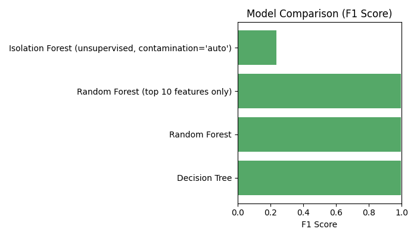
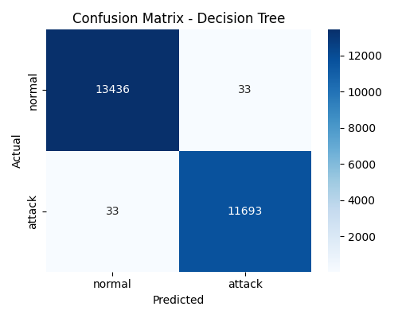
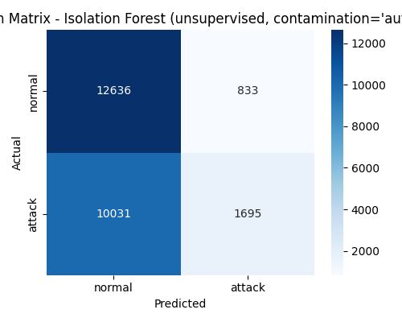
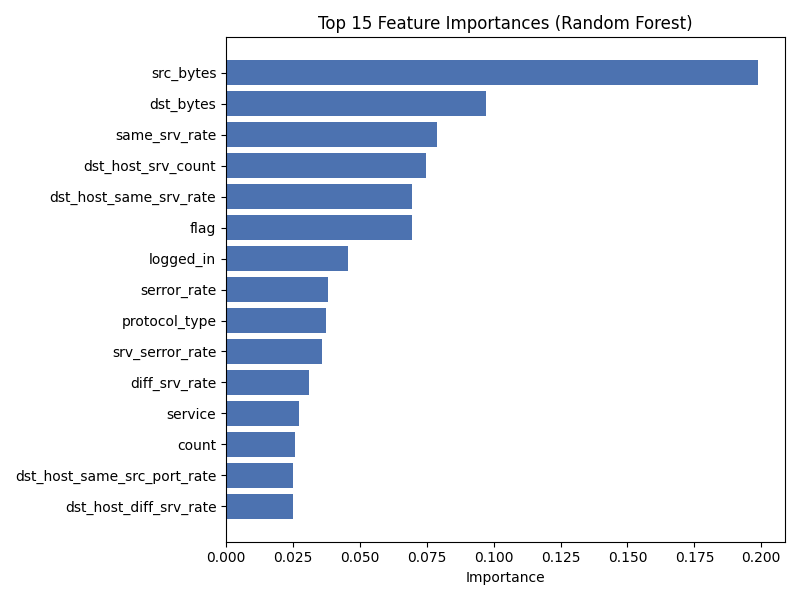

# Network Intrusion Detection on NSL-KDD

A Python project that classifies network connection records as normal traffic or an attack. I built it as a portfolio project for my computer science and data science degree, where I'm focusing on cybersecurity.

## Overview

Each row in the dataset describes one network connection: how long it lasted, which protocol it used, how many bytes moved each way, how many errors or failed logins occurred, and so on. The model reads those fields and predicts whether the connection looks like an attack. The idea is to flag connections for a person to review, not to block anything automatically. It works on logged data in a CSV file, not on live traffic.

## Dataset

NSL-KDD is a cleaned-up version of the KDD Cup 99 data, which came from a 1998 DARPA intrusion detection evaluation. Each record has 41 features, and the training file contains about 22 attack types from four families (DoS, probe, R2L and U2R).

The training file has 125,973 rows. The separate test file has 22,544 rows and includes 17 attack types that never appear in training.

The data is old, and its attacks are easier to tell apart from normal traffic than most modern ones. The results below say something about this dataset and should not be read as how the model would do on a real network today.

## Files

| File | What it does |
|---|---|
| `preprocessing.py` | Shared functions for loading, encoding and scaling, used by every script below |
| `01_load_and_explore.py` | Loads the data and prints its shape, column types and label counts |
| `02_preprocess.py` | Encodes the text columns, scales the numeric ones and makes a train/test split |
| `03_train_baseline_model.py` | Trains a decision tree baseline |
| `04_compare_models.py` | Compares a decision tree, a random forest and an isolation forest, ranks features and saves the charts |
| `05_scoring_tool.py` | Trains a model, then scores any new CSV from the command line |
| `07_test_generalization.py` | Trains on the training file and tests on the separate test file |

There is no `06`. That script was merged into `04`.

## Testing on the separate file

My first models scored about 99.8% on a random 80/20 split of the training file. Those test rows come from the same file the model learned from, so the score says little about new data. NSL-KDD includes a second file, `KDDTest+.txt`, that was collected separately. I trained on the full training file and tested on that one instead.

Accuracy dropped to 76.9% and recall to 61.5%, which means roughly four in ten real attacks were missed.

Breaking the results down by attack type showed where the misses were. The model caught the attacks that are common in training almost every time (`neptune` has 41,214 training rows) and missed most of the rare ones. `guess_passwd` has only 53 training rows, and the model caught none of its 1,231 rows in the test file.

## Fixing the class imbalance

My first fix was `class_weight='balanced'` on the random forest. It didn't help, and recall slipped to 60.3%. I was training on a binary label (normal or attack), which is already split about 54/46, so there was almost nothing for it to balance. The imbalance sits between attack types inside the attack class, and the binary label hides it.

The second fix worked. I kept the binary target but computed a weight for each training row from its original attack type, so rows from rare attacks count for more during training. Recall on the test file rose to 74.9%, and `guess_passwd` went from a 0% catch rate to 28.9%.

| Approach | Accuracy | Recall | F1 |
|---|---|---|---|
| No weighting | 0.769 | 0.615 | 0.752 |
| `class_weight='balanced'` on the binary label | 0.762 | 0.603 | 0.743 |
| Per-row weights from the detailed attack type | 0.828 | 0.749 | 0.832 |

Attack types missing from training are still mostly undetected (`apache2`, `mailbomb` and `snmpguess` are near 0%). Reweighting can't help with a class the model has never seen.

## Comparing models

These scores come from the random split of the training file, so they look much better than the results on the separate test file above.

| Model | Accuracy | Precision | Recall | F1 |
|---|---|---|---|---|
| Decision tree | 0.997 | 0.997 | 0.997 | 0.997 |
| Random forest | 0.998 | 0.999 | 0.997 | 0.998 |
| Random forest, top 10 features only | 0.998 | 0.999 | 0.996 | 0.998 |
| Isolation forest (`contamination='auto'`) | 0.569 | 0.670 | 0.145 | 0.238 |

| Decision tree | Random forest | Isolation forest |
|---|---|---|
|  |  |  |

## Isolation forest and a leakage mistake

In my first version I set the isolation forest's `contamination` to the true share of attacks in the training labels. That gave a model that is supposed to be unsupervised a piece of information it wouldn't have in practice, and it pushed the F1 up to 0.621. With `contamination='auto'` the F1 is 0.238. I changed the code and kept the lower number.

The isolation forest is still far behind the supervised models here. Its appeal is that it doesn't need labels, so in principle it could flag an attack type nobody has labeled yet. I haven't tested that.

## Feature importance

The random forest's own importance scores put `src_bytes`, `dst_bytes`, `same_srv_rate`, `dst_host_srv_count` and the SYN error rates (`serror_rate`, `srv_serror_rate`) near the top. A model trained on only the top 10 of the 40 features scored almost the same as the full model.

## Running it

1. Download `KDDTrain+.txt` and `KDDTest+.txt` from [Kaggle](https://www.kaggle.com/datasets/harivmv/nsl-kdd-dataset) or the [GitHub mirror](https://github.com/jmnwong/NSL-KDD-Dataset) and put them in the project folder.
2. Install the libraries with `pip install -r requirements.txt`.
3. Run `01_load_and_explore.py` through `04_compare_models.py` in order.
4. Score a CSV with `python 05_scoring_tool.py <path_to_csv>`.
5. Run the separate-file test with `python 07_test_generalization.py`.

The code uses pandas and scikit-learn, with matplotlib and seaborn for the charts.

## Limitations and next steps

- Everything is evaluated on one train/test split and one test file. Cross-validation would give a firmer picture.
- The settings (100 trees, max depth 10) were picked by hand and never tuned.
- The model only predicts normal or attack. Predicting the attack type is the obvious next experiment.
- It only uses NSL-KDD. Trying a newer dataset such as CICIDS2017 would show whether these findings hold up.
- I haven't checked whether the isolation forest catches any of the attack types the supervised model misses.
- There are no automated tests and no web interface yet.
